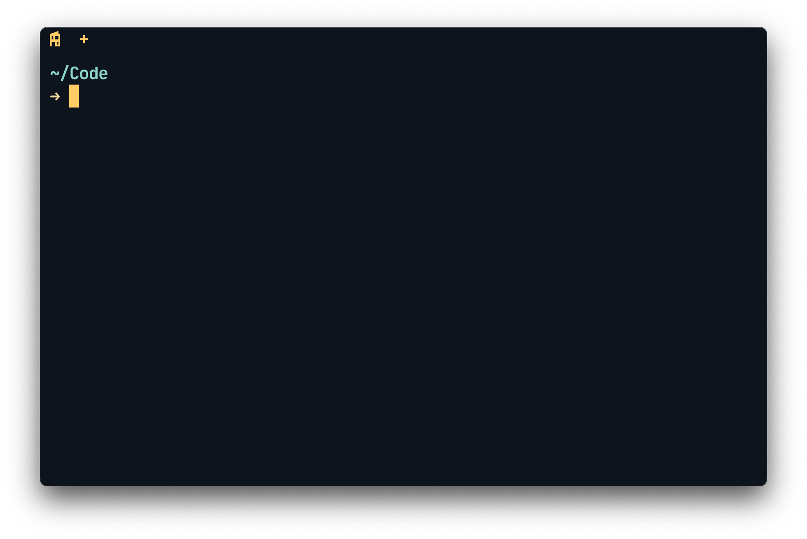
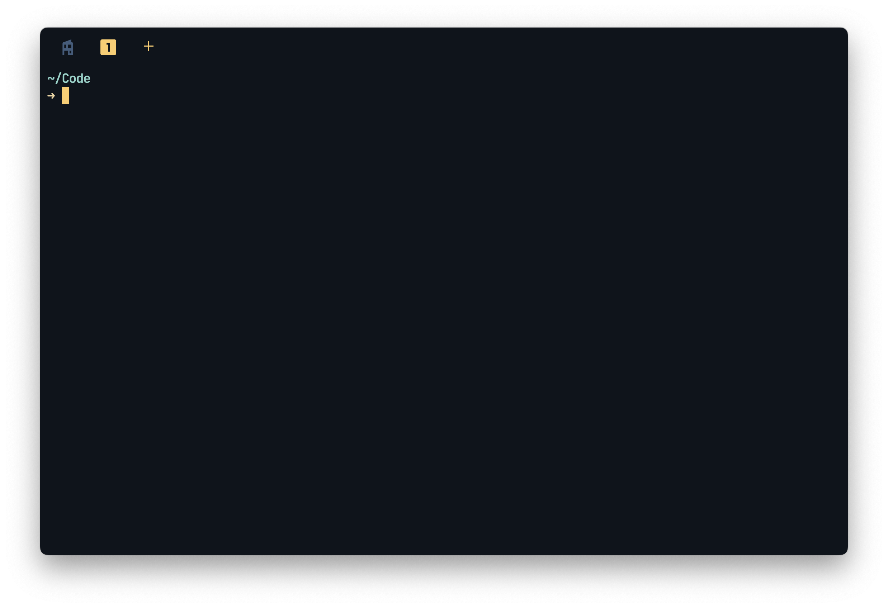
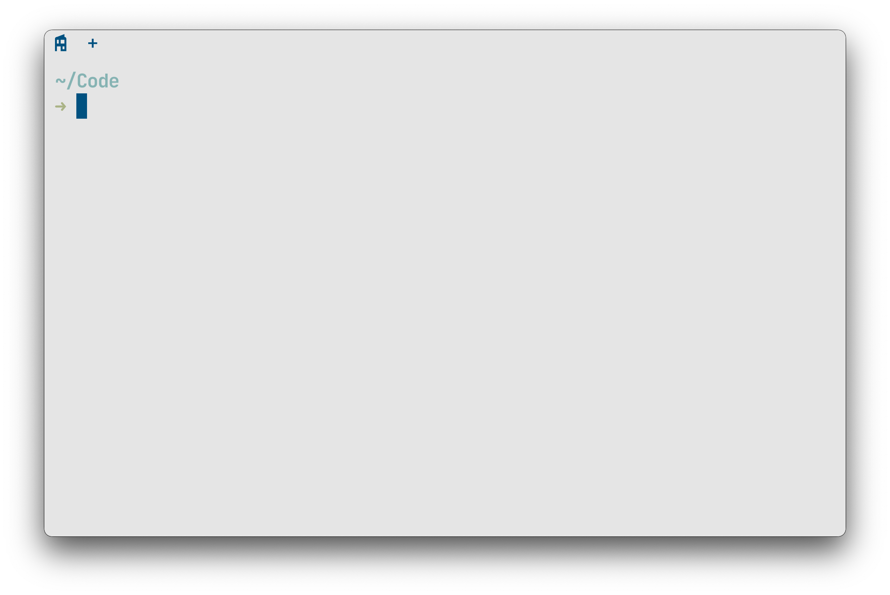
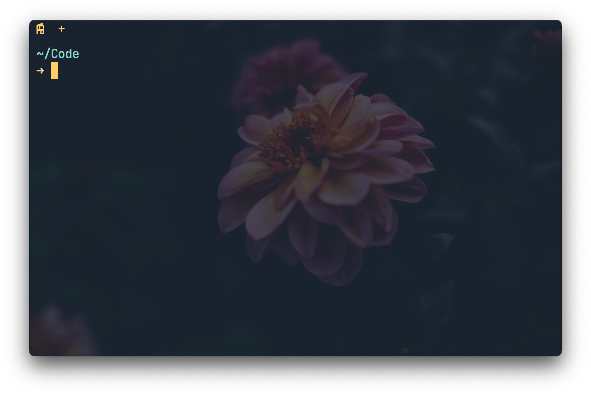

# On Wezterm

A gentle introduction to Wezterm and how to use Lua to configure it. 
[WezTerm](https://github.com/wezterm/wezterm) is a powerful, GPU-accelerated cross-platform terminal emulator and multiplexer 
written in Rust, configured using Lua.
I switch back and forth between Wezterm and [Ghostty](https://github.com/ghostty-org/ghostty).
Eventually I want to write a blog post, but for now this can just be a GitHub article :) A few screenshots:

When there's just one tab.


When there's more than one tab:


Light mode:


With a background image:


Every `wezterm.lua` configuration starts by requiring the core wezterm module. 
We create a config object using `wezterm.config_builder()`. This object acts as a container where we'll define all our configuration. 
Finally, the script must return this config object for Wezterm to load it.
On macOS, my configuration lives in `~/.config/wezterm/wezterm.lua`.
```lua
local wezterm = require 'wezterm'
local config = wezterm.config_builder()
return config
```

We can also split our configuration into several files and import them. I used to use separate files, but I often wanted to reference my colour scheme in several parts of the configuration, and it became easier to maintain a single file.
``` lua 
-- local key_config = require 'keys'
-- config.keys = key_config.keys -- Assuming keys.lua returns a table with a 'keys' field
```

## Setting locals
locals are scoped variables, comments are prefixed e.g. `--default_theme`.
``` lua
local dark = {  
    --default_theme = 'Ayu Mirage',  
    default_theme = 'Catppuccin Macchiato',  
    highlight = '#ffcc66',  -- orange    background = "#121a23", -- ay_bg_mid}  
  
local light = {  
    default_theme = 'nordfox',  
    highlight = '#005180', -- light grey    background = "white"  
}  
  
local wallpaper = {  
    background = 'white',  
}  
  
local theme = {  
    dark = dark,  
    light = light,  
    wallpaper = wallpaper  
}
```


I find it useful to be able to change the alpha of an existing colour, e.g. if I'm setting the pane split colour.
This helper function uses Wezterm's built-in colour manipulation. 
wezterm.color.parse(c) converts a colour string into an internal representation, .hsla() extracts its Hue, Saturation, Lightness, 
and Alpha components. wezterm.color.from_hsla() then constructs a new colour with the desired alpha.
```lua
local set_alpha = function(c, a)
    local fh, fs, fl, _ = wezterm.color.parse(c):hsla()
    return wezterm.color.from_hsla(fh, fs, fl, a)
end
```

We can later call this function:
```lua
split = set_alpha(theme.dark.highlight, 0.4)
```


I don't like the fancy tab bar, purely because I can't hide the close button on a tab. I also hide window decorations as I find them distracting.
```lua
config.use_fancy_tab_bar = false
config.hide_tab_bar_if_only_one_tab = false
config.tab_bar_at_bottom = false
config.window_decorations = "RESIZE"
config.window_frame = {
    font = wezterm.font { family = 'Inter' }, -- fancy bar only
    active_titlebar_bg = "none",              -- fancy bar only
    inactive_titlebar_bg = "none",            -- fancy bar only
    font_size = 16,                           -- fancy bar only
}
```

**UPDATE**: this is now supported by wezterm, so I can go back to using the fancy bar.
```lua
config.show_close_tab_button_in_tabs = false
```

```lua
config.show_close_tab_button_in_tabs = false
config.hide_tab_bar_if_only_one_tab = false  
config.tab_bar_at_bottom = false  
config.window_decorations = "RESIZE"  
config.use_fancy_tab_bar = true  
config.window_frame = {  
    font = wezterm.font { family = 'Inter' } 
}
```
### Setting the tab title
Wezterm allows customising tab titles dynamically using the format-tab-title event. 
We register a function using `wezterm.on` that gets called whenever a tab title needs to be generated. 
This function receives information about the tab, panes, and overall state.
```lua 
-- --> event sets the tab title
wezterm.on('format-tab-title', function(tab, tabs, panes, config, hover, max_width)
    local s = '󰎦 󰎩 󰎬 󰎮 󰎰 󰎵'
    local s2 = '󰇊 󰎦 󰎤, 󰇋 󰎩 󰎧, 󰇌 󰎬 󰎪, 󰇍 󰎮 󰎭, 󰇎 󰎰 󰎱, 󰇏 󰎵 󰎳'
    local utf8 = require("utf8")
    local title = tab.tab_title
    local main_title = (fun and '༼ つ ◕_◕ ༽つ ' or main)
    if title and #title > 0 then
        title = tab.tab_title
    elseif tab.tab_index == 0 then
        title = main_title
    elseif tab.tab_index > 0 and tab.tab_index < 7 then
        local symbols = {}
        for symbol in s:gmatch("([^%s]+)") do
            table.insert(symbols, symbol)
        end
        title = symbols[tab.tab_index]
    else
        title = "~"
    end
    return { { Text = ' ' .. title .. ' ' } }
end)
```

On `..`: lua uses `..` for string concatenation.
```lua
return { { Text = ' ' .. title .. ' ' } }
```


## Setting the background
One of the features which drew me to Wezterm was the ability to change background image. 
It's less practical using a background every day, but occasionally I like the aesthetic.

The toggle-background event sets a layered background:
- The bottom layer is the selected image file.
- The top layer is a semi-transparent solid colour.

```lua 
-- --> event toggles background image
wezterm.on('toggle-background', function(window, pane)
    local wallpaper_dir <const> = wezterm.home_dir .. '/.config/wezterm/wallpaper/'
    local ls_wallpapers = 'ls ' .. wallpaper_dir
    local overrides = window:get_config_overrides() or {}

    local palette = {
        default = {
            bg_colour = "#1f2430",
            bg_colour_darker = "#0a0e13",
            opacity = 0.8,
        },
        purple = {
            color_scheme = 'Dracula (Official)',
            bg_colour = "#1B1B1B",
            opacity = 0.95,
        }
    }

    local scheme = palette.default

    local images = {}
    -- populate images with contents of wallpaper_dir
    for dir in io.popen(ls_wallpapers):lines() do
        table.insert(images, dir)
    end

    -- --> event toggles color scheme depending on image
    if images[index] == "ihbv74x1z1w91.jpg" then
        scheme = palette.purple
    end

    overrides.color_scheme = scheme.color_scheme
    overrides.background = {
        { source = { File = wallpaper_dir .. images[index] } },
        {
            source = { Color = scheme.bg_colour },
            width = "100%",
            height = "100%",
            opacity = scheme.opacity
        }
    }

    window:set_config_overrides(overrides)
    index = (index % #images) + 1
end)

-- --> event simply clears the background image
wezterm.on('clear-background', function(window, pane)
    local overrides = window:get_config_overrides() or {}
    overrides.background = nil
    overrides.color_scheme = 'Ayu Mirage'
    window:set_config_overrides(overrides)
end)
```

On `io.popen`: The `io.popen('ls ' .. wallpaper_dir):lines()` command executes the shell command ls to list files in the wallpaper directory and iterates over its output line by line, populating the images table.

On `index = (index % #images) + 1`: this line calculates the next index to use from the `images` list. It makes sure that if the current index is the last one in the list, the next one becomes 1 (wrapping around to the beginning). Otherwise, it just increments the index to the next item. It uses the modulo operator (%) and adds 1 to handle Lua's 1-based list indexing correctly.

## Full Configuration
Below is the complete wezterm.lua configuration file, incorporating all the elements discussed above, plus keybindings, status bar setup, and other settings.

```lua
local wezterm = require 'wezterm'
local config = wezterm.config_builder()

-- vars including custom themes
local index = 1     -- maintains an index when looping through wallpaper
local fun = false   -- used to enable fun mode
local status = true -- used to enable status mode
-- local main = '󰋝'

-- ayu background color variations
-- ayu_bg = '#1f2430', ayu_bg_dark = "#0a0e13",
-- pale_blue = 'rgba(101, 195, 235, 0.5)',

local theme = {
    dark = {
        --default_theme = 'Ayu Mirage',
        default_theme = 'Catppuccin Macchiato',
        highlight = '#ffcc66',     -- orange
        background = "#121a23",    -- ay_bg_mid
        dim_status = "#3f4e70",    -- faded blue/gray
        dim_status_green = '#3f704d',
        lighter_status = '#6b85bf' -- lighter blue/gray
    },
    light = {
        default_theme = 'nordfox',
        highlight = '#005180', -- light grey
        background = "white"
    },
    wallpaper = {
        background = 'white',
    }
}

-- functions
-- set_alpha takes a color and returns a new color using the specified alpha
local function set_alpha(c, a)
    local fh, fs, fl, _ = wezterm.color.parse(c):hsla()
    return wezterm.color.from_hsla(fh, fs, fl, a)
end

-- check_vpn_status returns a non-negative number when a VPN is connected
local function check_vpn_status()
    local handle = assert(io.popen("ifconfig -a | grep -c utun6"))
    local result = handle:read("*a")
    handle:close()
    return tonumber(result) > 0
end

-- general
config.default_cwd = wezterm.home_dir .. "/Code"

-- font
config.font = wezterm.font('JetBrainsMono Nerd Font Mono', { weight = 500 })
config.font_size = 18
config.cell_width = 0.9
config.command_palette_font_size = 18

-- window and tab bar
config.show_close_tab_button_in_tabs = false
config.hide_tab_bar_if_only_one_tab = false
config.tab_bar_at_bottom = false
config.window_decorations = "RESIZE"
config.use_fancy_tab_bar = true
config.window_frame = {
    font = wezterm.font { family = 'Inter' }, -- fancy bar only
    active_titlebar_bg = "none",              -- fancy bar only
    inactive_titlebar_bg = "none",            -- fancy bar only
    font_size = 22,                           -- fancy bar only
}

-- colors
config.color_scheme = theme.dark.default_theme
config.colors = {
    cursor_bg = theme.dark.highlight,
    cursor_border = theme.dark.highlight,
    background = wezterm.color.parse(theme.dark.background):darken(0.2),
    split = set_alpha(theme.dark.highlight, 0.4),
    tab_bar = {
        background = "none", -- retro bar + fix bug with fancy bar when using status
        new_tab = { bg_color = "none", fg_color = theme.dark.highlight },
        new_tab_hover = { bg_color = "none", fg_color = theme.dark.highlight },
        inactive_tab = { bg_color = "none", fg_color = wezterm.color.parse(theme.dark.background):lighten(0.3) },
        inactive_tab_hover = { bg_color = "none", fg_color = wezterm.color.parse(theme.dark.background):lighten(0.3) },
        active_tab = { bg_color = "none", fg_color = theme.dark.highlight, intensity = 'Bold' },
        inactive_tab_edge = "none",
    }
}
config.inactive_pane_hsb = {
    saturation = 0.9,
    brightness = 0.8,
}

local function prompt_line()
    return wezterm.action.PromptInputLine {
        description = 'Enter new name for tab',
        action = wezterm.action_callback(function(window, pane, line)
            if line then
                window:active_tab():set_title(line)
            else
                window:active_tab():set_title("~")
            end
        end)
    }
end

-- keys
config.send_composed_key_when_left_alt_is_pressed = true
-- config.leader = { key = 'p', mods = 'CTRL', timeout_milliseconds = 1000 }
config.keys = {
    -- DISABLED
    -- { key = 'Tab', mods = 'ALT',          action = wezterm.action.DisableDefaultAssignment, },
    -- TAB
    { key = "0", mods = "SUPER",        action = wezterm.action.ActivateTab(0) },
    { key = "1", mods = "SUPER",        action = wezterm.action.ActivateTab(1) },
    { key = "2", mods = "SUPER",        action = wezterm.action.ActivateTab(2) },
    { key = "3", mods = "SUPER",        action = wezterm.action.ActivateTab(3) },
    { key = "4", mods = "SUPER",        action = wezterm.action.ActivateTab(4) },
    { key = "5", mods = "SUPER",        action = wezterm.action.ActivateTab(5) },
    { key = "6", mods = "SUPER",        action = wezterm.action.ActivateTab(6) },
    { key = "7", mods = "SUPER",        action = wezterm.action.ActivateTab(7) },
    { key = "8", mods = "SUPER",        action = wezterm.action.ActivateTab(8) },
    { key = "9", mods = "SUPER",        action = wezterm.action.ActivateTab(9) },
    -- { key = "Tab", mods = "ALT",          action = wezterm.action.SendString 'zellij action move-tab right\n' }, -- zellij fix
    -- LEADER
    { key = '|', mods = 'LEADER|SHIFT', action = wezterm.action.SplitHorizontal { domain = 'CurrentPaneDomain' }, },
    { key = '-', mods = 'LEADER',       action = wezterm.action.SplitVertical { domain = 'CurrentPaneDomain' }, },
    -- NAVIGATION
    { key = "d", mods = "SUPER",        action = wezterm.action.SplitHorizontal({ domain = "CurrentPaneDomain" }) },
    { key = "D", mods = "SUPER|SHIFT",  action = wezterm.action.SplitVertical({ domain = "CurrentPaneDomain" }) },
    { key = 'w', mods = 'SUPER',        action = wezterm.action.CloseCurrentPane { confirm = false } },
    -- EVENTS
    { key = 'b', mods = 'CTRL',         action = wezterm.action.EmitEvent 'toggle-background', },
    { key = 'B', mods = 'CTRL',         action = wezterm.action.EmitEvent 'clear-background', },
    { key = 's', mods = 'SHIFT|CTRL',   action = wezterm.action.EmitEvent 'toggle-status', },
    { key = 'f', mods = 'SHIFT|CTRL',   action = wezterm.action.EmitEvent 'toggle-fun', },
    { key = 'l', mods = 'SHIFT',        action = wezterm.action.EmitEvent 'toggle-light', },
    {
        key = 'e',
        mods = 'SUPER',
        action = wezterm.action.PromptInputLine {
            description = 'Enter new name for tab',
            action = wezterm.action_callback(function(window, pane, line)
                if line then
                    if string.find(line, "nu") then line = '󰬕' end
                    if string.find(line, "k8") then line = '󱃾' end
                    if string.find(line, "rust") then line = '󱘗' end
                    window:active_tab():set_title(line)
                else
                    window:active_tab():set_title("~")
                end
            end)
        }
    },
}

-- configure events
-- format-tab-title sets the tab title
wezterm.on('format-tab-title', function(tab, tabs, panes, config, hover, max_width)
    local toolbar_nerd_icons = {
        square_outline = '󰎦 󰎩 󰎬 󰎮 󰎰 󰎵', -- nerd
        square_filled = '󰎤 󰎧 󰎪 󰎭 󰎱 󰎳', -- nerd
        dice_filled = '󰇊 󰇋 󰇌 󰇍 󰇎 󰇏', -- nerd
        numbers = '1 2 3 4 5 6 7' -- ascii
    }
    local style = toolbar_nerd_icons.square_filled
    -- local utf8 = require("utf8")
    local main = '󰋝'
    local title = tab.tab_title
    local main_title = (fun and '༼ つ ◕_◕ ༽つ ' or main)

    if title and #title > 0 then
        title = tab.tab_title
    elseif tab.tab_index == 0 then
        title = main_title
    elseif tab.tab_index > 0 and tab.tab_index < 6 then
        local symbols = {}
        for symbol in style:gmatch("([^%s]+)") do
            table.insert(symbols, symbol)
        end
        title = symbols[tab.tab_index]
    else
        title = "~"
    end
    return { { Text = ' ' .. title .. ' ' } }
end)

-- toggle-background cycles the background image
wezterm.on('toggle-background', function(window, pane)
    local wallpaper_dir <const> = wezterm.home_dir .. '/.config/wezterm/wallpaper/'
    local ls_wallpapers = 'ls ' .. wallpaper_dir
    local overrides = window:get_config_overrides() or {}

    local palette = {
        default = {
            color_scheme = nil,
            bg_colour = "#1f2430",
            bg_colour_darker = "#0a0e13",
            opacity = 0.8,
        },
        purple = {
            color_scheme = 'Dracula (Official)',
            bg_colour = "#1B1B1B",
            bg_colour_darker = nil,
            opacity = 0.95,
        }
    }

    local scheme = palette.default

    ---@type any[]
    local images = {} -- populate image table with contents of wallpaper_dir
    for dir in io.popen(ls_wallpapers):lines() do
        table.insert(images, dir)
    end

    if images[index] == "ihbv74x1z1w91.jpg" then
        scheme = palette.purple
    end

    overrides.color_scheme = scheme.color_scheme
    overrides.background = {
        { source = { File = wallpaper_dir .. images[index] } },
        {
            source = { Color = scheme.bg_colour },
            width = "100%",
            height = "100%",
            opacity = scheme.opacity
        }
    }
    window:set_config_overrides(overrides)
    -- If index is less than or equal to #images, it simply increments index.
    -- If index becomes greater than #images, it wraps around to the beginning of the list.
    index = (index % #images) + 1
end)

-- clear-background clears the background image
wezterm.on('clear-background', function(window, pane)
    local overrides = window:get_config_overrides() or {}
    overrides.background = nil
    overrides.color_scheme = 'Ayu Mirage'
    window:set_config_overrides(overrides)
end)

-- toggle-fun activates fun mode which adds some graphical changes
wezterm.on('toggle-fun', function(window, pane)
    fun = not fun
end)

-- toggle-status activates/deactivates additional status icons e.g. VPN status
wezterm.on('toggle-status', function(window, pane)
    status = not status
end)

-- toggle-light activates/deactivates light/dark mode (dark mode default)
wezterm.on('toggle-light', function(window, pane)
    local overrides = window:get_config_overrides() or {}
    if not overrides.color_scheme then
        local colors = {
            cursor_bg = theme.light.highlight,
            cursor_border = theme.light.highlight,
            background = wezterm.color.parse('white'):darken(0.1),
            split = set_alpha(theme.dark.highlight, 0.4),

            tab_bar = {
                background = "none", -- retro bar only
                new_tab = { bg_color = "none", fg_color = theme.light.highlight },
                new_tab_hover = { bg_color = "none", fg_color = theme.light.highlight },
                inactive_tab = { bg_color = "none", fg_color = wezterm.color.parse(theme.light.background):darken(0.3) },
                inactive_tab_hover = { bg_color = "none", fg_color = wezterm.color.parse(theme.light.background):darken(0.3) },
                active_tab = { bg_color = "none", fg_color = theme.light.highlight, intensity = 'Bold' }
            }
        }
        overrides.colors = colors
        --overrides.color_scheme = 'Night Owlish Light'
        overrides.color_scheme = 'Brush Trees (base16)'
        --overrides.color_scheme = 'Catppuccin Latte'
    else
        overrides.color_scheme = nil
        overrides.colors = nil
    end
    window:set_config_overrides(overrides)
end)

local function check_current_shell()

end

local function basename(s)
    if not s then
        return "?" -- or return whatever default you prefer
    end
    return string.match(s, "[^/]+$") or s
end

update-right-status updates the right status bar
wezterm.on('update-right-status', function(window, pane)
    local icons = {
        vpn_on = "󰲝", --  VPN connected
        vpn_off = "󰲜", -- VPN disconnected
        fish_shell = '󰬍', -- fish shell 󰈺󰬍
        nu_shell = '󰬕', -- nu shell
        zsh_shell = '󰬡', -- zsh shell
    }
    local vpn_status = check_vpn_status()
    local interactive_shell = basename(pane:get_foreground_process_name())
    local vpn_icon = vpn_status and icons.vpn_on or icons.vpn_off
    -- Fuchsia
    local vpn_color = vpn_status and theme.dark.lighter_status or theme.dark.dim_status
    local shell_icon = icons[interactive_shell .. "_shell"] or "?"
    local shell_icon_color = interactive_shell == 'fish' and theme.dark.dim_status or theme.dark.dim_status_green

    -- if status then
    --     window:set_right_status(wezterm.format {
    --         { Foreground = { AnsiColor = vpn_color } },
    --         { Text = vpn_icon .. '    ' .. interactive_shell .. '      ' },
    --     })
    -- else
    --     window:set_right_status("")
    -- end

    if status then
        -- Initialize elements table
        local spacer = "   "
        local elements = {}

        -- Add VPN icon with its color
        table.insert(elements, { Foreground = { Color = vpn_color } })
        table.insert(elements, { Text = vpn_icon })

        -- Add separator
        table.insert(elements, { Text = spacer })

        -- Add interactive shell with different color (you can customize this)
        table.insert(elements, { Foreground = { Color = shell_icon_color } })
        table.insert(elements, { Text = shell_icon })

        -- Add final spacing
        table.insert(elements, { Text = "     " })

        -- Set the right status with all elements
        window:set_right_status(wezterm.format(elements))
    else
        window:set_right_status("")
    end

    -- eventually I might use elements
    -- https://wezfurlong.org/wezterm/config/lua/window/set_right_status.html?h=set_r
end)

-- return configuration
return config

```